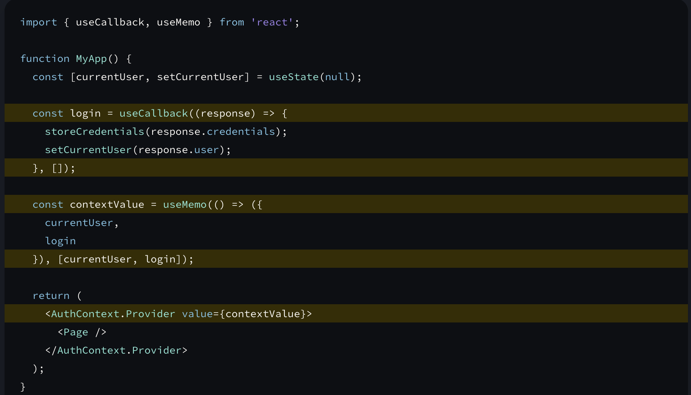

* Either wrap a method dependecy in a `useCallback` or move the method within the body of the effect:
  
* If you’re writing a `custom Hook`, <u>it’s recommended to wrap any functions that it returns into `useCallback`.</u> This ensures that the consumers of your Hook can optimize their own code when needed.
* If you forget the dependency array, `useCallback` will return a new function every time.
* The `context` from a `useContext` itself does not hold the information, it only represents the kind of information you can provide or read from components.
* React automatically re-renders components that read some context if it changes.
* `useContext()` always looks for the closest provider <u>above</u> the component that calls it. It searches upwards and does not consider providers in the component from which you’re calling `useContext().`
* Extract Contexts into Reducers and Hooks to expose the methods to scale them:
  
  <br/><iframe src="https://codesandbox.io/embed/crimson-glitter-hwl4y7?fontsize=14&hidenavigation=1&theme=dark"
     style="width:100%; height:500px; border:0; border-radius: 4px; overflow:hidden;"
     title="crimson-glitter-hwl4y7"
     allow="accelerometer; ambient-light-sensor; camera; encrypted-media; geolocation; gyroscope; hid; microphone; midi; payment; usb; vr; xr-spatial-tracking"
     sandbox="allow-forms allow-modals allow-popups allow-presentation allow-same-origin allow-scripts"
   ></iframe>
  Moving the `useContext` into a hook doesn’t change the behavior in any way, but it lets you later split these contexts further or add some logic to these functions. Now all of the context and reducer wiring is in TasksContext.js. This keeps the components clean and uncluttered, focused on what they display rather than where they get the data.

* Wrapping `Context` values in `useCallback` and `useMemo` will help optimize the values in larger applications:
  
* Inline style properties are written in camelCase. For example, HTML `<ul style="background-color: black">` would be written as `<ul style={{ backgroundColor: 'black' }}>`  in your component.
* `useEffect` is a Hook, so you can only call it at the top level of your component or your own Hooks. You can’t call it inside loops or conditions. If you need that, extract a new component and move the state into it.
* If you’re not trying to `synchronize` with some external system, you probably <u>don’t need an Effect.</u>
* <u>You don’t need Effects to transform data for rendering.</u> For example, let’s say you want to filter a list before displaying it. You might feel tempted to write an Effect that updates a state variable when the list changes. However, this is inefficient. When you update the state, React will first call your component functions to calculate what should be on the screen. Then React will “commit” these changes to the DOM, updating the screen. Then React will run your Effects. If your Effect also immediately updates the state, this restarts the whole process from scratch! To avoid the unnecessary render passes, transform all the data at the top level of your components. That code will automatically re-run whenever your props or state change.
* <u>You don’t need Effects to handle user events.</u> For example, let’s say you want to send an `/api/buy POST` request and show a notification when the user buys a product. In the Buy button click event handler, you know exactly what happened. By the time an Effect runs, you don’t know what the user did (for example, which button was clicked). This is why you’ll usually handle user events in the corresponding event handlers.
* When something can be calculated from the existing props or state, don’t put it in state. Instead, calculate it during rendering.
* Try to write every `Effect` as an independent process and think about a single setup/cleanup cycle at a time. It shouldn’t matter whether your component is mounting, updating, or unmounting. When your cleanup logic correctly “mirrors” the setup logic, your `Effect` is resilient to running setup and cleanup as often as needed.
* <u>If you’re not connecting to any external system, you probably don’t need an Effect.</u>
* Effects are an <u>escape hatch</u>: you use them when you need to <i>step outside React</i> and when there is no better built-in solution for your use case.
* Downsides of `effects` to `fetch` data:
  * The run only on server: This means the Server rendered app will not have the data and hence will need to run the full JS on Client side again
  * Fetching directly in Effects makes it easy to create `network waterfalls`.
  * Fetching directly in Effects usually means you don’t preload or cache data. For example, if the component unmounts and then mounts again, it would have to fetch the data again.
* You can’t “choose” the dependencies of your Effect. Every reactive value used by your Effect’s code must be declared as a dependency.
* Using `updater methods` while setting state removes the inifinite render cycle:
  <br/>
  <iframe src="https://codesandbox.io/embed/hopeful-tharp-m5cpnj?fontsize=14&hidenavigation=1&initialpath=App.js&module=%2FApp.js&theme=dark&view=editor"
     style="width:100%; height:500px; border:0; border-radius: 4px; overflow:hidden;"
     title="hopeful-tharp-m5cpnj"
     allow="accelerometer; ambient-light-sensor; camera; encrypted-media; geolocation; gyroscope; hid; microphone; midi; payment; usb; vr; xr-spatial-tracking"
     sandbox="allow-forms allow-modals allow-popups allow-presentation allow-same-origin allow-scripts"
   ></iframe>
* Avoid using a function or an object created during rendering as a dependency. Instead, declare it inside the Effect.
* `Effect Events` are not reactive and must always be omitted from dependencies of your `Effect`:
  ```js
  function Page({ url, shoppingCart }) {
  const onVisit = useEffectEvent(visitedUrl => {
    logVisit(visitedUrl, shoppingCart.length)
  });

  useEffect(() => {
    onVisit(url);
  }, [url]); // ✅ All dependencies declared
  // ...
  }
  ```
* This is what lets you put <u>non-reactive</u> code (where you can read the latest value of some props and state) inside of them.
* If you have cleanup code without corresponding setup code, it’s usually a code smell.
* The primary benefit of `useId` is that `React` ensures that it works with server rendering. During server rendering, your components generate HTML output. Later, on the client, hydration attaches your event handlers to the generated HTML. For hydration to work, the client output must match the server HTML.
* 