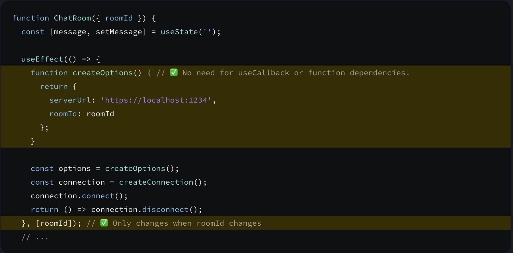

* Either wrap a method dependecy in a `useCallback` or move the method within the body of the effect:
  
* If you’re writing a `custom Hook`, <u>it’s recommended to wrap any functions that it returns into `useCallback`.</u> This ensures that the consumers of your Hook can optimize their own code when needed.
* If you forget the dependency array, `useCallback` will return a new function every time.
* The `context` from a `useContext` itself does not hold the information, it only represents the kind of information you can provide or read from components.
* React automatically re-renders components that read some context if it changes.
* `useContext()` always looks for the closest provider <u>above</u> the component that calls it. It searches upwards and does not consider providers in the component from which you’re calling `useContext().`
* Extract Contexts into Reducers and Hooks to expose the methods to scale them:
  
   <iframe src="https://codesandbox.io/embed/crimson-glitter-hwl4y7?fontsize=14&hidenavigation=1&theme=dark"
     style="width:100%; height:500px; border:0; border-radius: 4px; overflow:hidden;"
     title="crimson-glitter-hwl4y7"
     allow="accelerometer; ambient-light-sensor; camera; encrypted-media; geolocation; gyroscope; hid; microphone; midi; payment; usb; vr; xr-spatial-tracking"
     sandbox="allow-forms allow-modals allow-popups allow-presentation allow-same-origin allow-scripts"
   ></iframe>
* Wrapping `Context` values in `useCallback` and `useMemo` will help optimize the values in larger applications:
  
* 