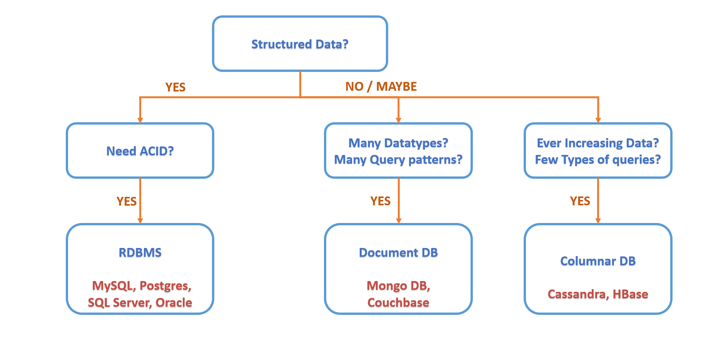

<h3>High level design</h3>
* HLD talks about the Overall Architecure of the system
* Design with scalability in mind
* Can it meet the latency, scalability and performance requirements they might have
* Break the system into multiple components into services and micro-services
* Interactions between services. Do they use sync or async communications
* What kind of protocols do they use? `HTTP`, `WebSockets` or `RPC`
* What kind of Database are we going to use
* Design should be future proof, non restricting and modular
* Talk about functional requirements, ask and be clear on them
* NFR's scale expectations, latency and consistency
  
<h4>Steps to approaching an HLD:</h4>
  1. Propose a design
  2. Talk about tradeoff's say DB's
  3. For each of your components discuss which one makes more sense as per design choices
  4. Talk about the limitations of the design say Monitoring or Analytics
  
<h3>Low level design</h3>
* Digs deeper into HLD
* Implementation specifics
* Optimization in terms of Code ensuring maintainability
* Structure of the code, should be working and clean code
* Design should be non restrictive and modular again
* Get reuirements FR + NFR
* For Code define the Interfaces first, API's etc and clean layers
* Class hierarchy and their implementations and interactions
* Each of the Classes should be clean and cler responsilbilities as well
* Entities and Data models needs to be defined as well
* Design Patterns that can be used as well
* Code should be in a working condition and all the basic test cases should be passing
* It should be modular
* Each piece should be testable individually
* Each method does one thing and does it well
  
### Basic building blocks
* Bound by Technology  - very hard to move away from framworks - this is for monoliths.
* Traffic spikes - Monoliths make it tricky to scale.
* Deployment is heavy
* Exponential issues which starts choking all the other modules as well
* Microservices based arch - break the system into some logical components aligned with team composition
* Separation of Concerns
* Easy for Engineers to understand what is going on
* Faster iterations as it is light and can have smaller cheaper deployments
* Always tradeoffs - either Mono or Microservices can be great
  
* Microservices add:
  * Higher Latency
  * Network failures and retries error handling
  * Easy to make backward incomaptible changes that break on Production
  * Automation of contract  testing can help in such cases
  * Operational costs - Microservices need more instrumentation for proper log tracing etc
  * Building Log aggregation system is an added cost
  * Service discovery needs some help from the infra
  * Systems like configuration managers, access policy, Messaging system, auto scaling etc need to be maintained
  * If we have 100's or 1000's of MicroServices then the above cost becomes negligible
  * Mostly in interviews use MicroServices based approach
  
* Services interaction
* Sync - when service waits for its downstream system to respond back
* In case of an error it might send the error back to the caller ot cascade ot back to the caller.
* Async - Fire and Forget, does not care about the results
* Say when placing an order at en e-commerce platform we might want to use fire and forget for calls like notifications, the failure of which should not cancel the whole order.
* Sync Systems have very high latency
* Process becomes very tightly coupled
* High maintenance cost and Complex Code
* Even if we go all async that might not work either
* So we want to have a hybrid system
* Some functionalities which are mandatory and some which are not
* Mandatory ones can be sync functions
* Message Queues are highly fault tolerant and simple data structures
* Publishers publish messages and consumers consume them
* These queues also store messages so that the Consumers can consume them at their own pace
* This enables System stability even if some services are down
* MQ's also help us scale easily
* Reduces Code Complexity as well
  
### Communication Protocols
* Client - Server -> Client Driven
* Datacenters have several servers and servers handle several of these requests
* Stateless - Any Server can handle the request
* HTTP and HTTP(s)
* RESTful API's - A standard that makes the API more user friendly
* `GET`, `POST`, `DELETE` etc make self explanatory APIs
* WebSockets are persistent connections, are bidirectional
* Server can send message to the client whenever it wants
* Optimized for high frquency communication
* Reduced latency with Websockets
* Saved CPU+Bandwidth
* WebSockets normally cost a lot because of the hardware
* Persistent Connections for millions of users
### Hashing
* normal Hashing - We get a hash a function of the machin
* This meant adding a machine changed the hash as well as we are doing % (number of servers)
* Consistent Hashing - The hash method will normalize both the machine and the data to a certain value
* Having a ring of the number line and a distribution of numbers across this circle
* Addin servers will mean a more balanced distrubution of servers
* Cassandra uses consistent hashing to distribute all of its data across all the nodes
* DynamoDB also uses the same
* Couchbase as well a document database
### Caching
* Faster memory for quicker access
* User information say
* Say for Twitter - We can save user data on a Cache
* But User might see stale tweets for a while in this case
* In some cases this might not be an ideal UX
* Computationally heavy data
* Save network calls
* Commonly Recently used data
* It is RAM/SSD based and costly
* If the same data is used across several journey
* Write Heavy/Read Once does not need a Cache
* If the repetition of a request is very low
* How much to store
* Cache eviction policies - Size based and time based
* Time based - After a few seconds, evict - TTL based
* Size based - X number of records will be there
* We can use FIFO to evict the oldest record (not very often used)
* LRU/LFU - data which is not used frequently 
* LFRU - combination of LRU and LFU to evict the data
* Cache should be small and should not have a great size
* Is it saving Latency - Super fast DB
* Cache miss rate - Inverse metric of Cache hit rate
* Redis and MemCached
### Databases
* Normally NFR are impacted by Database choices
* Structure of the data
* Query patterns
* Scale of the data
* File storage - Images, Videos etc for say Netflix, Amazon etc
* Blob Storage - These are not databases which you can query on - Amazon S3 example
* Along with Storage we might be needing a CDN to distribute that resource
* Amazon - Text searching capability on title or description etc
* For above Text Search Engine - Elastic Search or Solr Built on top of Lucene
* Fuzzy search - spelling correction etc
* We can define fuzziness factor to correct typos etc
* These are also not DB's
* DBs give guarantee that data wont be lost but in EKS data could be lost still
* Metrics kind of data, Grafana etc - TSDB extension of RDB
* Normally RDB have the ability to update random data records
* TSDB will be append only as these do not support a lot of edits
* InfluxDB, OpenTSDB is a TSDB
* Lot of information which needs to be stored for analytics kind of requirements
* Like how many orders, sought after items etc
* This needs a DataWarehouse
* A large Database which serves a lot of reports
* Generally used for offline reporting
* Hadoop can be used, not used for a lot of transactions
* Structed information - RDB if We need ACID 
* Tables, rows columns can be used to represnt data
* If we dont need ACID guarantee - we can still RDB or non RDB either way
* If we do not have structured data
* If we need to build say Catalog for Amazon say a Shirt will have certain attribute
* Lot of data in terms of data structure and queries then we use Document DB
* Mongo, CouchBase
* If we dont have complex queries we can still use NoSQL data
* If we have ever increasing data say Uber driver data is increasing each day
* Plus if we have finite number of queries
* Columnar DB - Cassandra and HBase are the most stable ones
* We might need to use a combination of DB solutions
   
   

### Rate Limiting
* Method of limiting network traffic that can be sent or received by an entity
* Can be Number of requests or number of read writes etc
* Say Each User can send max 20 requests per minute
* Maybe show them a captcha to prove they are not a bot
* From each IP address we will not allow more than 100 in a min
* Similar for Read and Write Requests etc
* Similar idea can be applied for User tiering
* Anti Bots, DOS and DDOS attacks
* Avoid Spam
* Apply a limit to the number of requests that can be made in a certain time window
* 